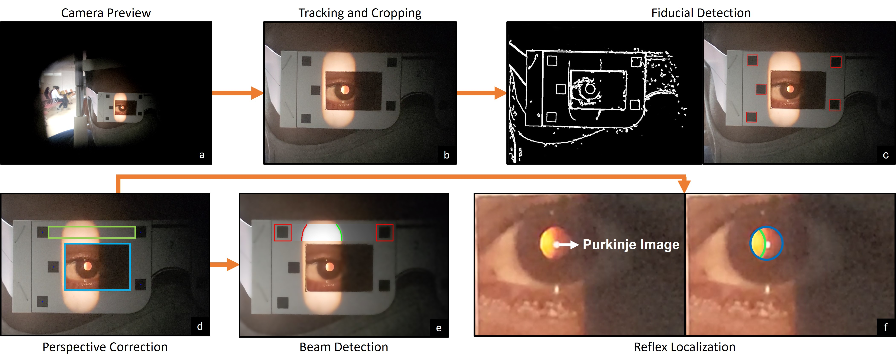

# Auto-retinoscopy

This repo contains the code for the video analysis pipeline for the paper *Towards Automating Retinoscopy for Refractive Error Diagnosis* accepted at the IMWUT 2022. The input to the system is a *retinoscopic video*, with the patient wearing a custom pair of paper frames, and the output is the net refractive power of the eye along the scoped meridian.

The aim of this README is to describe in detail the video analysis pipeline for ease of understanding and usage by a beginner user. The readme describes in detail the different functions and parameters of the pipeline along with the code snippets.

The figure below illustrates the (a) Proposed setup consisting of a retinoscope attached to a smartphone, (b) the setup from the patient’s viewpoint facing the logMAR chart, (c) retinoscope and its vergence sleeve, and (d) a single frame of the digital retinoscopy video with automatic detection of fiducials, pupil, reflex edges, and beam edges, using our video processing pipeline.

<p align='center'>
      
</p>

## Dependencies

```
* Python3.7.XX
* numpy==1.18.5
* opencv-contrib-python==4.4.0.42
* opencv-python==4.4.0.42
* Pillow==7.2.0
* scikit-image==0.15.0
* scikit-learn
* scipy
* matplotlib==3.0.3
* PyYAML==5.3.1
```

These are all easily installable via, e.g., `pip install numpy`. Any reasonably recent version of these packages should work. It is recommended to use a python `virtual` environment to setup the dependencies and the code.

## Image Processing Pipeline Overview

<p align='center'>
      
</p>


The video analysis pipeline takes as input the video collected via a smartphone attached to the retinoscope, and outputs the net refractive power of the eye along the scoped horizontal meridian. The analysis pipeline first performs **pre-processing** (*image cropping, and tracking*) on the input image. The next step is to detect the **fiducial markers**, and correct for the perspective distortions. This is followed by **beam and pupil detection and reflex edge localization** in the respective search spaces. Finally the refractive power is estimated based on the mathematical model explained in the paper.

## Running Script

`python annotate_init_bbox.py --input_dir <input_dir> --video <video_name.mp4> --frame_size 2`

This command will prompt the user to draw a rough bounding box across the paper frame. The frame size and input bounding box will be saved in the *init_bbox.csv* file.

`python velocity_pipeline.py --video <video_name.mp4>`

This command will load the default parameters from the *input_params.yaml* and save the intermediate frames with detected fiducials, beam, pupil and reflex in the output directory. The final predicted power will be stored in the output csv file in the same directory.

## About the code:

* `velocity_pipeline.py` : This is the main file which processes the video based upon input parameters.
* `annotate_init_bbox.py` : Prompts the user to draw initial rough bounding box across the paper frame.
* `beam.py` : Detects the pixel locations of the retinoscopic beam given the location of the fiducial markers.
* `eyes.py`: Detects the pupil and pixel locations for the left and right reflex edge given the cropped region of interest.
* `fiducials.py`: Detects the square fiducials in the input video.
* `glasses.py` : Selects the type and size of paper frame design.
* `utils.py`: Contains supporting utility functions for tracking, cropping, etc.

### Additional Modules

* `FSRCNN_x4.pb` : Contains the weights of model used for super resolving the image.
* `template_2_curr.png` : image of the current frame design used for perspective correction.
* `input_params.yaml` : default input parameters used in the video analysis pipeline.

## Input Parameters

* `start_frame_index`: Starting frame in the video. Keep 0 by default
* `end_frame_index`: Ending frame in the video. Keep -1 for processing entire video
* `scaling_factor`: Default scaling factor: 1

* `input`:
    * `directory_path`: path to the input directory
    * `init_bbox_file`: name of the csv file containing init bbox

* `output_path`:
    * `original_frames`: path to the directory saving original video frames.
    * `tracking_frames`: path to the directory saving final annotated frames.
    * `raw_warped_frames`: path to the directory saving perspective corrected frames.
    * `eyes_frames`: path to the directory saving intermediate frames of pupil and reflex detection.
    * `beam_frames`: path to the directory saving intermediate frames of beam detection.
    * `glasses_frames`: path to the directory saving intermediate frames of fiducial detection.
    * `numpy_path`: path to the directory saving numpy output of all the detected entities.

* `output`:
    * `directory_path`: output directory path.
    * `save_original_frames`: Boolean to save original frames.
    * `save_tracking_frames`: Boolean to save annotated output frames.
    * `run_glasses_detection`: Boolean to run fiducial detection. This is required for beam/reflex detection.
    * `run_beam_segmentation`: Boolean to run beam detection.
    * `run_reflex_segmentation`: Boolean to run pupil and reflex edge detection.
    * `save_numpy_output`: Boolean to save detected entities in the form of numpy array.
    * `power_prediction`: Boolean to predict power using proposed mathematical formulation.

* `eyes`:
    * `scaling_factor`: Scaling factor for reflex detection. Default: 4.
    * `pupillary_margin`: Margin around detected pupil.
    * `pupil_hough_param2_max_value`: Hough parameter for pupil detection.
    * `pupil_hough_param2_min_value`: Hough parameter for pupil detection.
    * `pupil_min_radius`: Minimum radius of pupil.
    * `pupil_max_radius`: Maximum radius of pupil.
    * `averaging_window`: Window size for gradient based reflex edge calculation.
    * `histogram_bar_size`: Histogram width for finding center coordinates of pupil.
    * `pupil_pass_separator`: Maximum number of allowed frames where pupil is not detected within the single pass.
    * `median_pupil_radius_margin`: Allowed margin for pupil radius around median pupil radius.
    * `reflex_vertical_column_percent`: Percentage of reflex along the column so that it is not considered part of specular reflex

* `glasses`:
    * `square_tolerance`: Allowed tolerance for fiducial square
    * `fiducials_min_area`: Minimum area of detected fiducial
    * `fiducials_extent`: Extent of detected contour with square
    * `fiducials_aspect`: Allowed aspect ratio of detected contours to be called as square
    * `fiducials_side`: Square fiducials, Default: 4
    * `number_of_fids`: Number of fiducials in the frame. For current pattern, its 5
    * `fiducial_real_size_cm`: Size of fiducial in real: 0.5 cm
    * `fid_centers_right_curr_2`: List of centers of fiducial squares in the template image (Right eye)
    * `fid_centers_left_curr_2`: List of centers of fiducial squares in the template image (Left eye)
    * `fid_bbox_size`: Size of fiducials in template image (in pixels)

* `power_calculation`:
    * `minimum_passes_reqd`: Minimum passes required for power calculation
    * `number_lines`: Number of lines to scope within pupil
    * `pupil_vertical_allowed_range`: Allowed central region in the pupil for line plotting along the y-axis
    * `pupil_horizontal_allowed_range`: Allowed central region in the pupil for timestamp selection along the x-axis
    * `horizontal_line_width_reflex`: Width of the plotting line
    * `start_per1`: Start point for reflex edge 1
    * `start_per2`: Start point for reflex edge 2
    * `end_per1`: End point for reflex edge 1
    * `end_per2`: End point for reflex edge 2
    * `effective_light_distance`: Effective light source distance

* `device`:
    * `camera_sensor_height`: Camera sensor height used for working distance estimate.
    * `camera_focal_length`: Camera sensor focal length used for working distance estimate.

**Note** : The video processing pipeline for now only supports retinoscopic beam scoped along horizontal meridian at 0 degree, with video resolution at `4096 x 2160` pixels. Although, the working distance is calculated automatically using size of detected fiducials, capture videos from 30-40 cm from the eyes to maintain the trade-off between resolution and decreasing pupil size due to accommodation.

## Disclaimer
`This is a research project and not an approved medical software and should not be used for diagnostic purposes.`

## Contributing

This project welcomes contributions and suggestions.  Most contributions require you to agree to a
Contributor License Agreement (CLA) declaring that you have the right to, and actually do, grant us
the rights to use your contribution. For details, visit https://cla.opensource.microsoft.com.

When you submit a pull request, a CLA bot will automatically determine whether you need to provide
a CLA and decorate the PR appropriately (e.g., status check, comment). Simply follow the instructions
provided by the bot. You will only need to do this once across all repos using our CLA.

This project has adopted the [Microsoft Open Source Code of Conduct](https://opensource.microsoft.com/codeofconduct/).
For more information see the [Code of Conduct FAQ](https://opensource.microsoft.com/codeofconduct/faq/) or
contact [opencode@microsoft.com](mailto:opencode@microsoft.com) with any additional questions or comments.

## Trademarks

This project may contain trademarks or logos for projects, products, or services. Authorized use of Microsoft 
trademarks or logos is subject to and must follow 
[Microsoft's Trademark & Brand Guidelines](https://www.microsoft.com/en-us/legal/intellectualproperty/trademarks/usage/general).
Use of Microsoft trademarks or logos in modified versions of this project must not cause confusion or imply Microsoft sponsorship.
Any use of third-party trademarks or logos are subject to those third-party's policies.
